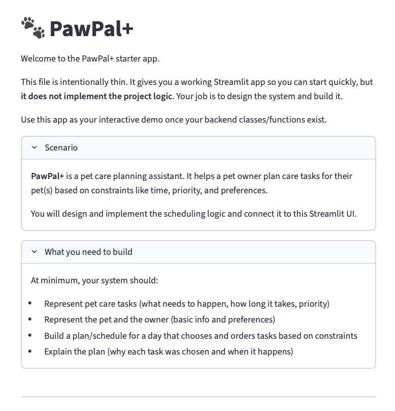
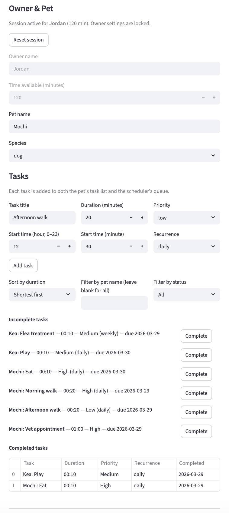
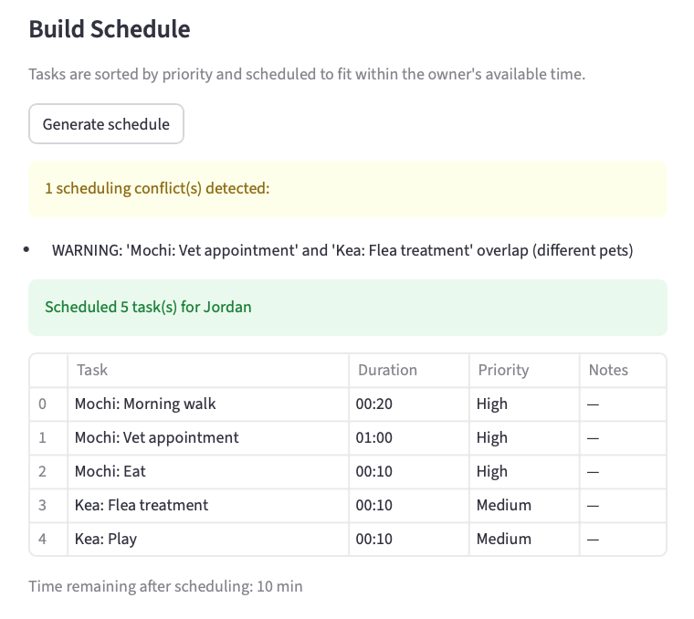

# PawPal+ (Module 2 Project)

You are building **PawPal+**, a Streamlit app that helps a pet owner plan care tasks for their pet.

## Scenario

A busy pet owner needs help staying consistent with pet care. They want an assistant that can:

- Track pet care tasks (walks, feeding, meds, enrichment, grooming, etc.)
- Consider constraints (time available, priority, owner preferences)
- Produce a daily plan and explain why it chose that plan

Your job is to design the system first (UML), then implement the logic in Python, then connect it to the Streamlit UI.

## What you will build

Your final app should:

- Let a user enter basic owner + pet info
- Let a user add/edit tasks (duration + priority at minimum)
- Generate a daily schedule/plan based on constraints and priorities
- Display the plan clearly (and ideally explain the reasoning)
- Include tests for the most important scheduling behaviors

## Getting started

### Setup

```bash
python -m venv .venv
source .venv/bin/activate  # Windows: .venv\Scripts\activate
pip install -r requirements.txt
```

### Suggested workflow

1. Read the scenario carefully and identify requirements and edge cases.
2. Draft a UML diagram (classes, attributes, methods, relationships).
3. Convert UML into Python class stubs (no logic yet).
4. Implement scheduling logic in small increments.
5. Add tests to verify key behaviors.
6. Connect your logic to the Streamlit UI in `app.py`.
7. Refine UML so it matches what you actually built.

### Smarter Scheduling

Added new features:
- Display task duration in HH:MM format
- Method to sort tasks by duration
- Filter tasks by completion status and pet
- After marking a recurring task as complete, the next occurrence is automatically scheduled and its due date set
- Added a method to produce a warning if tasks (for the same pet or different pets) with any time overlaps are scheduled

## Features

- **Priority-based scheduling** — Tasks are ranked high/medium/low and sorted numerically so the most critical care always gets scheduled first within the owner's available time budget.
- **Time-budget enforcement** — The scheduler tracks the owner's remaining minutes and skips any task that would exceed it, preventing over-scheduling.
- **Sorting by duration** — Tasks can be listed shortest-to-longest (or reversed), making it easy to spot quick wins or identify time-heavy commitments.
- **Conflict warnings** — Any two tasks whose `start_time` windows overlap trigger a warning message, flagging same-pet double-booking as well as cross-pet scheduling collisions.
- **Daily & weekly recurrence** — Marking a recurring task complete automatically calculates the next due date (+ 1 day or + 7 days) and queues a fresh copy in the scheduler.
- **HH:MM duration formatting** — Raw minute values are converted to a human-readable `HH:MM` string for cleaner display in logs and the UI.
- **Flexible task filtering** — Tasks can be filtered by completion status (`incomplete`/`complete`) and/or by pet name, returning only the relevant subset for display or further processing.
- **Plan explanation** — After generating a schedule, the scheduler produces a plain-English summary listing each task in order and reporting how many minutes remain after scheduling.

## Testing PawPal+

In the terminal, run tests using `python -m pytest` (or `python3 -m pytest`).

The tests implemented include tests to verify sorting (ascending by duration, descending by duration, and by priority), recurrence (next day/week, no next task created when task is not recurring, and adding a next task grows the scheduler by 1), conflict detection (warning when overlapping, no warning when not overlapping), and that tasks with durations longer than the avilable minutes are ignored.

## Demo





## UML Design

