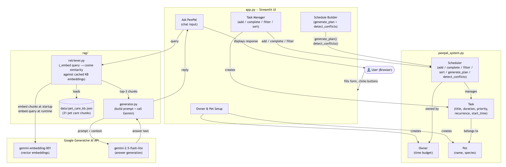

# PawPal++ (Final Project with RAG)

## Description of original project (PawPal+)

**PawPal+** is a Streamlit app that helps a pet owner plan care tasks for their pet. Users can enter details for pets, enter tasks for their pets, sort tasks (by duration, pet, completion status), and view the complete schedule. 

## Title and Summary

This updated project is called PawPal++. The difference with the original project is that I've added a chatbot which connects with Gemini. Users can ask questions about pet care, such as how often should they bathe their dog. The chatbot has RAG implementation, which pulls information about pet care from my database. 

## Architecture Overview: A short explanation of your system diagram.

The pet care database is sent to gemini-embedding-001, and each chunk (a piece of information in the database) is produced into a vector of numbers, which represents the meaning of the chunk. These vectors are stored in a cache. When a user types a query into the chat, the query is produced into a vector as well. That query vector is compared to the stored vectors, and the top 3 most similar stored vectors/chunks are passed as context to Gemini 2.5 Flash Lite to generate an output.  

## Setup Instructions: Step-by-step directions to run your code.

First, run `pip install -r requirements.txt` or `pip3 install -r requirements.txt` to download the requirements if you have not already done so.

Then to start streamlit in your local machine, run `streamlit run app.py`. 

## Sample Interactions: Include at least 2-3 examples of inputs and the resulting AI outputs to demonstrate the system is functional.

Sample input 1: "how much exercise does my dog need"
Output 1: "Most adult dogs need 30-60 minutes of exercise per day! If you have a high-energy breed like a Border Collie or Husky, they'll need over 2 hours. For smaller breeds like Chihuahuas or Pugs, 20-30 minutes of light exercise is usually enough."

Sample input 2: "how often should I bathe my dog?"
Output 2: "You should bathe your dog every 4-6 weeks. Bathing too often can strip their natural oils and lead to dry, itchy skin."

## Design Decisions: Why you built it this way, and what trade-offs you made.

At first I used stopwords. But I was not getting any outputs even when I typed questions that could have been answered from the database. So I switched to semantic comparision using gemini-embedding-001. But the trade-off is that each query now costs an API call to the embedding model, and it takes a longer time to generate responses. If the database or the number of queries gets large, this may not be an efficient way. 

## Testing Summary: What worked, what didn't, and what you learned.

All 26 tests passed. I learned how easily bugs can get into the code and how hard it is to find every bug, because when I asked the AI at least twice to help me find bugs in the codebase, each time it would find something to change. 

## Reflection: What this project taught you about AI and problem-solving.

This project taught me many things including semantic comparison, which I found was a much better way of retrieving relevant information from the database. 

## Demo link

https://youtu.be/nKbHsDJL3DQ
